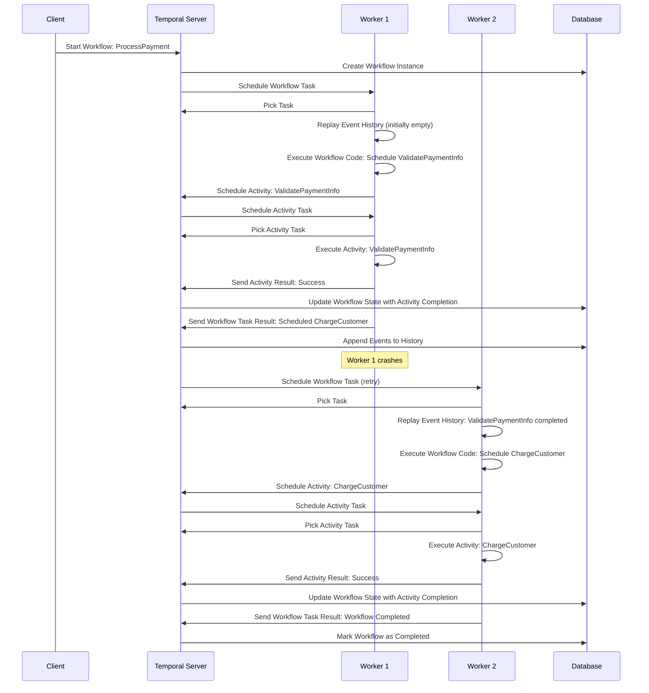

Have you ever built a distributed system that felt like herding cats? You know the feeling - one service fails, state gets lost, and suddenly you're debugging a cascade of failures at 2 AM. If this sounds familiar, you're not alone.

Distributed systems are inherently complex. Managing state, handling failures, and ensuring tasks complete reliably can quickly turn into a nightmare. But what if there was a way to simplify all of this complexity?

Enter Temporal, a platform that acts like a reliable project manager for your code, keeping everything on track no matter what goes wrong. In this post, we'll explore what Temporal is, why it's incredibly useful, and how it works behind the scenes.

## What is Temporal?

Think of Temporal as a smart coordinator that manages your business processes and keeps them running smoothly. At its core, Temporal is a platform that ensures your tasks complete reliably, even when things go sideways.

Here's what makes Temporal special:

- **Fault tolerance**: Your workflows automatically recover from failures
- **State persistence**: Nothing gets lost, even if your entire system crashes
- **Scalability**: Handle anything from simple tasks to complex, multi-step processes
- **Language flexibility**: Works seamlessly with Go, Java, Python, and more

To put it simply, Temporal is like having a project manager that never sleeps, never forgets, and never gives up on completing your tasks.

## Why Should You Care About Temporal?

You might be wondering, "Why not just use existing tools or build retry logic myself?" Here's why Temporal stands out:

### Easier Failure Handling

Instead of writing complex retry logic and error handling for every service, Temporal handles all of this automatically. Failed tasks? Temporal retries them. Network timeouts? Temporal manages them. Service crashes? Temporal picks up where you left off.

### Long-Running Workflows

Some processes take hours, days, or even months to complete. Traditional approaches struggle with this, but Temporal excels at managing long-running workflows without breaking a sweat.

### Real-Time Visibility

Ever wondered what's happening inside your distributed system? Temporal provides real-time visibility into your workflows, showing you exactly where things are and what's happening at any moment.

### Developer Experience

Temporal lets you write workflow logic in your preferred programming language using familiar patterns. No need to learn complex configuration languages or wrestle with XML files.

## Core Components That Make It Work

Understanding Temporal becomes much easier when you know its key building blocks:

### Workflows
These define the sequence of steps in your process. Think of them as the blueprint that describes what needs to happen and in what order.

### Activities
These are tasks that can have side effects - things like calling external APIs, writing to databases, or sending emails. Activities represent potential failure points, which is why Temporal treats them specially and provides automatic retry mechanisms.

### Workers
The processes that execute your workflow and activity code. Workers are like diligent employees that pick up tasks and complete them.

### Temporal Server
The orchestrator that coordinates everything. It schedules tasks, manages state, and ensures nothing falls through the cracks.

## How Temporal Works Its Magic

Here's where things get interesting. Temporal uses some clever techniques to achieve its reliability:

### Event Sourcing
Instead of just storing the current state of your workflow, Temporal records every event that happens (like "task started", "task completed", "error occurred"). This creates a complete history of what transpired.

### State Persistence
All these events get saved in a database, ensuring durability. Even if your entire system goes down, nothing is lost.

### Failure Recovery
When a worker crashes, another worker can pick up the task by replaying the event history. But what does "replaying" actually mean?

Think of it like Git for your workflow execution. Just as Git stores a complete history of commits that you can replay to recreate any point in your codebase, Temporal stores a complete history of events that it can replay to recreate any point in your workflow.

When a new worker takes over, it doesn't just guess where things left off. Instead, it reads through the complete event log (like "payment validation started", "payment validation completed", "charge customer started") and re-executes the workflow code step by step. 

Here's the clever part: when the workflow code says "validate payment", but Temporal sees that event already happened, it **skips the actual validation and just returns the previous result**. The workflow continues until it reaches a step that hasn't been completed yet - that's where the new worker picks up the real work.

This replay process rebuilds the exact state the crashed worker was in, ensuring nothing is lost or duplicated.

### Deterministic Execution
Temporal ensures that replaying the same sequence of events always produces the same outcome, providing consistency and predictability.

## Visualizing the Flow

Let's see how this works in practice with a payment processing workflow:

### What's Happening Here?

1. **Client** initiates the payment workflow
2. **Temporal Server** orchestrates everything and persists state
3. **Worker 1** starts processing but crashes after validating payment info
4. **Worker 2** seamlessly takes over by replaying the event history
5. **Database** stores everything, ensuring nothing is lost

The beautiful part? All the state management and recovery happens behind the scenes. Your business logic remains clean and focused on what it should do, not how to handle failures.

## A Simple Example

Let's imagine you're building a payment processing system with these steps:

1. Validate payment information
2. Charge the customer
3. Send a receipt

In a traditional system, if your service crashes after charging the customer but before sending the receipt, you might end up charging them again when you restart. With Temporal, the framework knows exactly what happened. When the system recovers, it picks up where it left off and sends the receipt without recharging the customer.

This is the power of Temporal - it handles the complex orchestration while you focus on business logic.

## Getting Started

Ready to give Temporal a try? Here's what you can do next:

- **Explore the documentation**: Check out the [official Temporal docs](https://docs.temporal.io/) to dive deeper
- **Try the tutorials**: Start with the getting started guides for your preferred language
- **Join the community**: Connect with other developers using Temporal on their [community forum](https://community.temporal.io/)
- **Start small**: Pick a simple workflow in your current system and see how Temporal could simplify it

## Wrapping Up

Distributed systems don't have to be a source of sleepless nights. Temporal makes them manageable by handling the hard parts - fault tolerance, state management, and failure recovery - so you can focus on building great features.

Whether you're dealing with complex microservices, long-running business processes, or just want more reliable systems, Temporal offers a compelling solution that's worth exploring.

Have you worked with workflow orchestration tools before? What challenges have you faced with distributed systems? I'd love to hear about your experiences and how tools like Temporal might fit into your architecture.