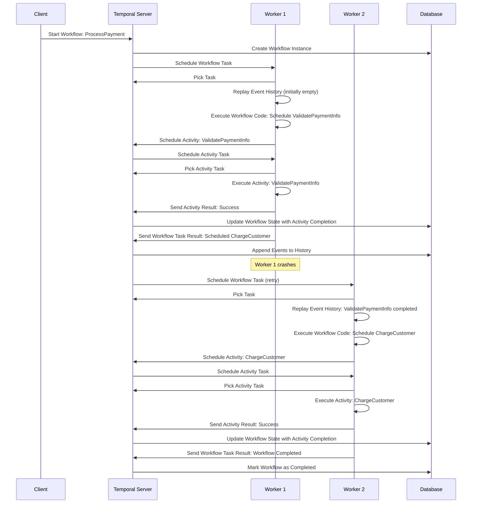

## Blog Post Outline

Here’s an outline for a blog post that introduces Temporal’s high-level concepts in simple terms, using the Temporal Workflow Map to illustrate its mechanics.

### Title
**Understanding Temporal: Simplifying Distributed Systems**

### Introduction
- Distributed systems are complex—managing state and failures can be a nightmare.
- Temporal simplifies this by providing a durable execution framework.
- In this post, we’ll explore what Temporal is, why it’s useful, and how it works, with a visual map to make it clear.

### What is Temporal?
- **Definition**: A platform for orchestrating workflows that ensures tasks complete reliably.
- **Key Features**:
  - Fault tolerance
  - State persistence
  - Scalability
- **Analogy**: Temporal is like a project manager that keeps your code on track, no matter what happens.

### Why Use Temporal?
- **Easier Failure Handling**: Retries and timeouts are handled automatically.
- **Long-Running Workflows**: Supports processes that take days or months.
- **Visibility**: See what’s happening in your workflows in real-time.
- **Language Flexibility**: Works with languages like Go, Java, and Python.

### Core Components
- **Workflows**: The sequence of steps in your process.
- **Activities**: Individual tasks, like calling an API.
- **Workers**: Processes that run your code.
- **Temporal Server**: Coordinates tasks and manages state.

### How Temporal Works
- **Event Sourcing**: Records events (e.g., "task started") instead of just the current state.
- **State Persistence**: Events are saved in a database for durability.
- **Failure Recovery**: Replays event history to resume workflows after crashes.
- **Deterministic Execution**: Ensures consistent outcomes.

### Visualizing the Flow: Temporal Workflow Map
- **Overview**: A diagram showing how a payment processing workflow runs in Temporal.
- **Steps**:
  - Client starts the workflow.
  - Temporal Server schedules tasks.
  - Workers execute activities and update the server.
  - If a worker crashes, another resumes by replaying the event history.
- **Insight**: State management and recovery happen behind the scenes.

## Temporal Workflow Map

This Mermaid sequence diagram shows the flow of a sample workflow, including a failure scenario to demonstrate Temporal’s state persistence and recovery mechanism.

### Diagram Explanation
- **Client**: Initiates the workflow by requesting the Temporal Server to start it.
- **Temporal Server**: Orchestrates the workflow, schedules tasks, and persists state in the database.
- **Workers**: Execute workflow logic and activities. If Worker 1 fails after completing an activity, Worker 2 picks up the task, replays the event history, and continues the workflow.
- **Database**: Stores the event history, ensuring durability and enabling recovery.

This visual highlights Temporal’s ability to manage state and recover from failures seamlessly.

---

### Simple Example
- **Use Case**: A payment workflow—validate payment, charge customer, send receipt.
- **Temporal in Action**: If a crash occurs after charging, Temporal resumes and sends the receipt without recharging.

### Conclusion
- Temporal makes distributed systems easier by handling the hard parts.
- Try it out—check the Temporal docs and start building reliable apps.

